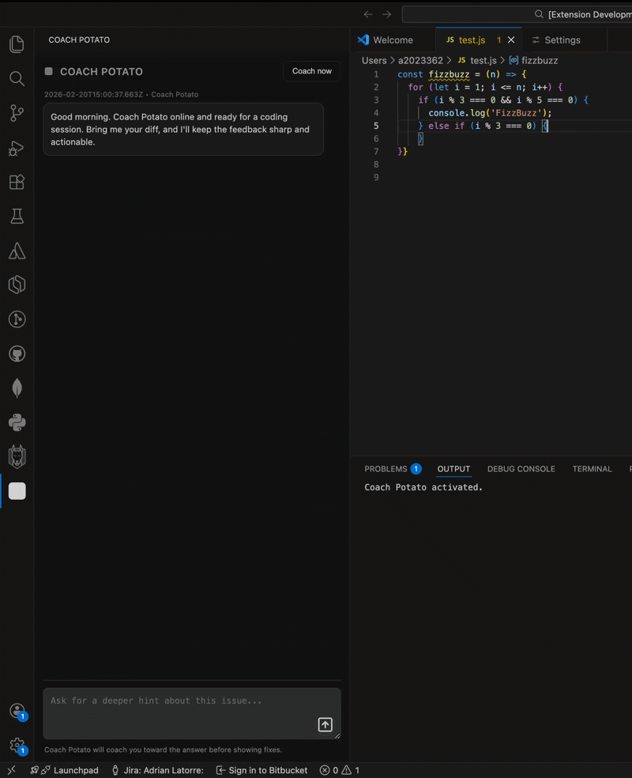

# Coach Potato

Coach Potato is your tiny coding sidekick in VS Code.
You save a file, it peeks at your diff, and gives one sharp coaching point (or tells you your code is clean).
Think less "wall of AI text", more "one useful nudge at the right time".

<p align="center">
  
</p>

[Open demo GIF](example/coach-potato.gif)

## Links

- VS Code Marketplace: `TODO_ADD_MARKETPLACE_LINK`
- GitHub Releases:  [v0.0.1](https://github.com/willylatorre/coach-potato/releases/tag/v0.0.1)

## Install (Start Here)

### Option A: Install from VS Code Marketplace
1. Open VS Code.
2. Open Extensions (`Cmd+Shift+X` / `Ctrl+Shift+X`).
3. Search for `Coach Potato`.
4. Click **Install**.

### Option B: Install from a `.vsix` file (from GitHub Releases)
1. Download the latest `.vsix` from this repo’s Releases page.
2. Install with command line:

```bash
code --install-extension coach-potato-<version>.vsix
```

Or in VS Code:
1. Open Extensions view.
2. Click `...` (top-right).
3. Click **Install from VSIX...**
4. Select the downloaded file.

## What It Does

- Runs analysis on save (configurable).
- Focuses on changed lines (diff-first coaching).
- Gives one high-impact suggestion at a time.
- Supports follow-up Q&A in the sidebar.
- Supports providers:
  - `openai`
  - `anthropic`
- Lets you tune coaching tone:
  - `gentle | direct | strict`

## Local Development

1. Install dependencies:

```bash
npm install
```

2. Configure API key (recommended via env var):

```bash
export COACH_POTATO_API_KEY="your-api-key"
```

3. Build:

```bash
npm run compile
```

4. Press `F5` in VS Code to run the Extension Development Host.

## Notes

- This repo does not include any API key.
- You can override `coachPotato.apiBaseUrl` if needed.
